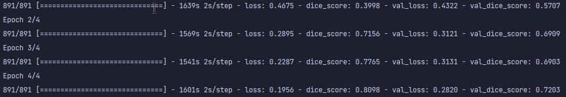
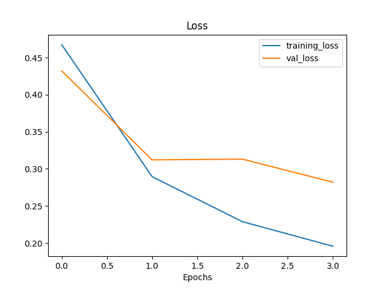
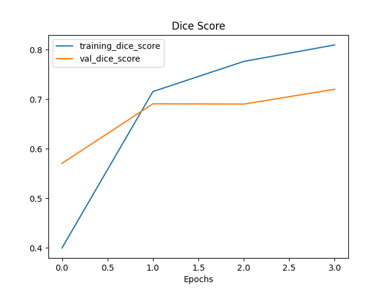
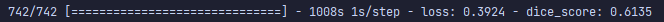
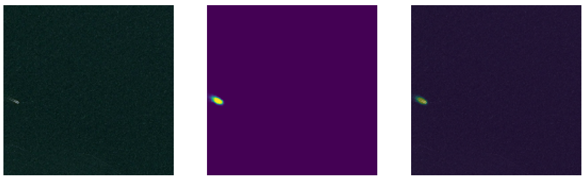
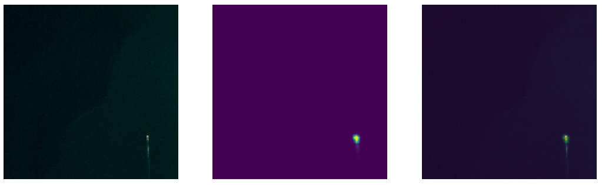
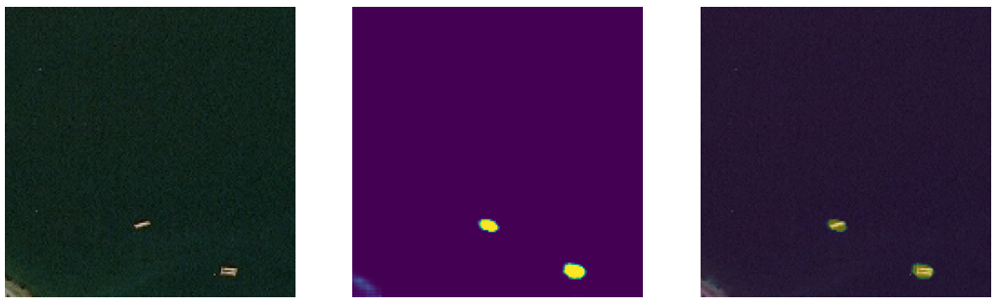
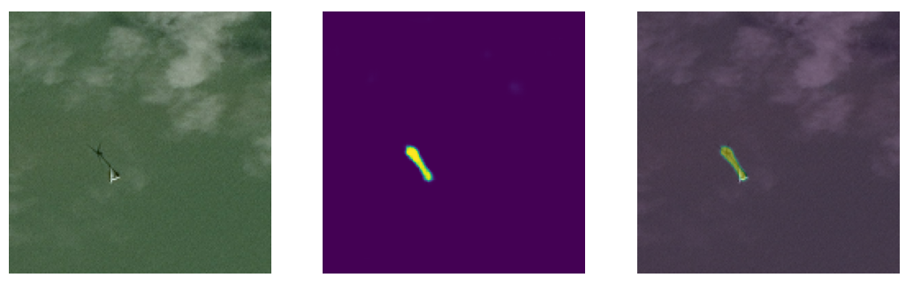
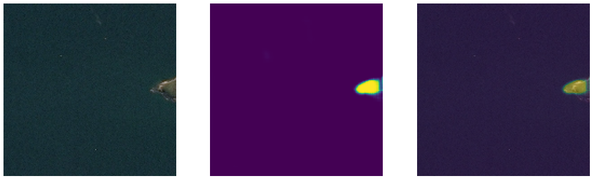
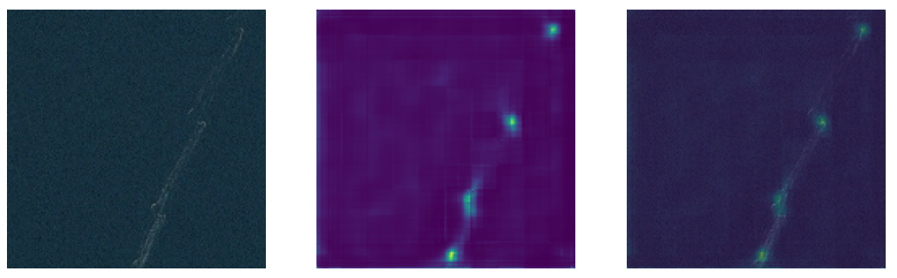

# asd_challenge
### Airbus Ship Detection Challenge

---

## About Project
That my implementation for Airbus Ship Detection Challenge.
Dataset downloaded from Kaggle [Challenge](https://www.kaggle.com/competitions/airbus-ship-detection/data), you also can download it if you have Kaggle account.
My model based on TensorFlow/Keras frameworks. 
Implementation containing model architecture such as a simple U-Net for image semantic segmentation.
In project also used the libraries: NumPy, Pandas and Matplotlib.

**_Project have that files_**:
- **dataset_analysis.ipynb** -- containing exploring of data from Challenge.
- **cfg/config.yaml** -- for storing config variables for model.
- **model_debugger.py** -- it's core code file with calling all function and classes for preprocessing data, 
  building, training and using model.
- **model_builder.py** -- file with function for building model with Keras functional API and classes of custom
- metric and loss function.
- **training_process.py** -- file with function for training model.
- **inference_process.py** -- file with function for testing model.
- **data_handler.py** -- file with class for building batch with images and masks.
- **utils.py** -- file with all support functions.
- **requirements.txt** -- file which store name all libraries that require for this project.

---

## Model Architecture

Model architecture has:
- Input layer with shape=(160, 160)
- data_augmentation layer (for augmented data only in training process)

And standard U-Net architecture from code example in 
Keras documentation ([Image Segmentation with a U-Net-like architecture](https://keras.io/examples/vision/oxford_pets_image_segmentation/#prepare-unet-xceptionstyle-model)):

[My model build code for this project](src/model_builder.py)

---

## Downloading and testing model

First get the repository
```commandline
git clone https://github.com/lytmercy/asd_challenge.git
```
Next you need step into repo directory
```commandline
cd asd_challenge
```
Next create new python environment (my python is 3.10).
```commandline
python -m venv venv
```
Activate new environment
```commandline
./venv/Scripts/activate
```
And install all requirements
```commandline
pip install -r requirements.txt
```
And finally run the debugger.py in console
```commandline
python src/model_debugger.py
```

If you want check training process you can move out files of weight from path `models/trained/weights/*`
```commandline
mv models/trained/weights/* your/path/for/my/weights/*
```
And next run again `model_debugger.py`

---

## Demonstrating the result

In order not to wait a long time for the training result, 
I used only 30% of the images from those with a ground-truth mask.

### Dice Loss
For Dice Coefficient, I use this formula and subtract it from 1, to get dice loss. From this [science paper (on page 6)](https://arxiv.org/pdf/1606.04797v1.pdf):


### Hyperparameters

For the training I use that hyperparameters:
- learning_rate = 0.001
- number of epochs = 4
- batch size = 22 (because my GPU can't process more)

### Results

In result of training, I got this:
- dice_loss = 0.1890
- dice_score = 0.8150
- val_dice_loss = 0.3031
- val_dice_score = 0.7109



And got this curves of loss and dice score:

**Dice Loss Function**



**Dice Score Metric**



In result of evaluating, I got this:
- dice_loss = 0.3924
- dice_score = 0.6135



### Prediction from model

And take prediction from model, I got this:

**Good results** with one or more ships:





And **bad results** model predicts when getting an image with some terrain 
and some other stuff that recognize as ships on empty sea images.




